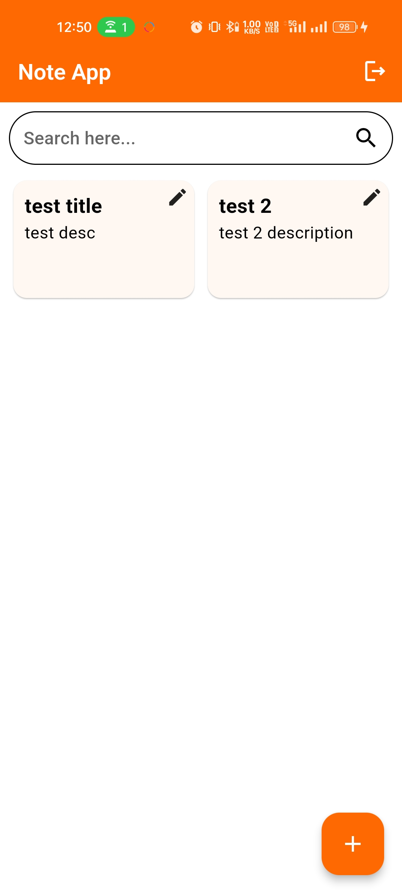
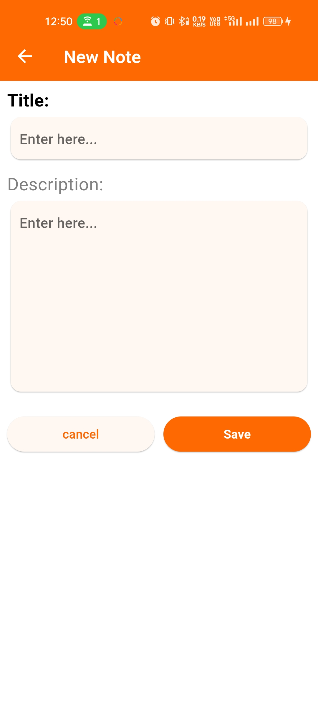
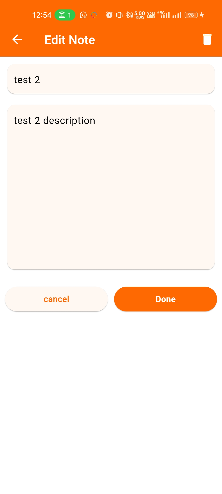

<h1 align="center">Flutter Note App</h1>

  This Flutter project is a simple note-taking app that allows users to register, login, and perform CRUD operations on notes through API calls. Users can retrieve all notes, add new notes, edit existing notes, and delete notes.

  
  
  

## Features

* **User Authentication:** Users can register and login securely to access their notes.
* **View All Notes:** Retrieve a list of all notes from the API.
* **Add New Note:** Create and save a new note.
* **Edit Note:** Modify the content of an existing note.
* **Delete Note:** Remove a note from the app.

## Dependencies
- HTTP: For making HTTP requests.
